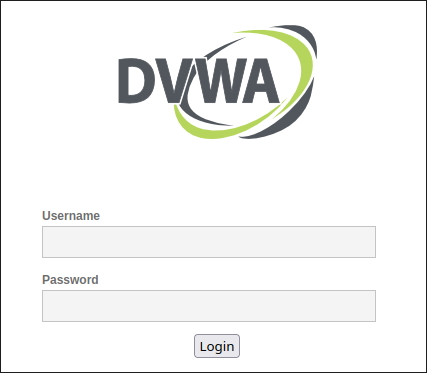

---
## Front matter
lang: ru-RU
title: Индивидуальный проект. Этап 2
subtitle: 
author:
  - Матюхин Г.В.
institute:
  - Российский университет дружбы народов, Москва, Россия
date: 21 сентября 2024

## i18n babel
babel-lang: russian
babel-otherlangs: english

## Formatting pdf
toc: false
toc-title: Содержание
slide_level: 3
aspectratio: 169
section-titles: true
theme: metropolis
header-includes:
 - \metroset{progressbar=frametitle,sectionpage=progressbar,numbering=fraction}
---

# Цель работы

Установите DVWA в гостевую систему к Kali Linux.

# Выполнение лабораторной работы

# Установка Docker

## Добавим GPG ключ

```bash
sudo apt-get update
sudo apt-get install ca-certificates curl
sudo install -m 0755 -d /etc/apt/keyrings
sudo curl -fsSL https://download.docker.com/linux/debian/gpg -o /etc/apt/keyrings/docker.asc
sudo chmod a+r /etc/apt/keyrings/docker.asc
```

## Добавим репозиторий с источники Apt

```bash
$ echo \
    "deb [arch=$(dpkg --print-architecture) signed-by=/etc/apt/keyrings/docker.asc] \
    https://download.docker.com/linux/debian bookworm stable" | \
    sudo tee /etc/apt/sources.list.d/docker.list > /dev/null
$ sudo apt-get update
```

## Установим компоненты и проверим работоспособность

```bash
$ sudo apt-get install docker-ce docker-ce-cli \
    containerd.io docker-buildx-plugin docker-compose-plugin
```

```bash
$ sudo docker run hello-world
```

# Запуск DVWA

## Docker compose 1/2

```yaml
services:
  dvwa:
    build: .
    image: ghcr.io/digininja/dvwa:latest
    # Change `always` to `build` to build from local source
    pull_policy: always
    environment:
      - DB_SERVER=db
    depends_on:
      - db
    networks:
      - dvwa
    ports:
      - 127.0.0.1:4280:80
    restart: unless-stopped
```

## Docker compose 2/2

```yaml
  db:
    image: docker.io/library/mariadb:10
    environment:
      - MYSQL_ROOT_PASSWORD=dvwa
      - MYSQL_DATABASE=dvwa
      - MYSQL_USER=dvwa
      - MYSQL_PASSWORD=p@ssw0rd
    volumes:
      - dvwa:/var/lib/mysql
    networks:
      - dvwa
    restart: unless-stopped
```

## Запустим контейнеры.

```bash
$ docker compose up
```

## Страница приложения



# Выводы

На данном этапе проекта я установил DVWA в гостевую систему к Kali Linux.
