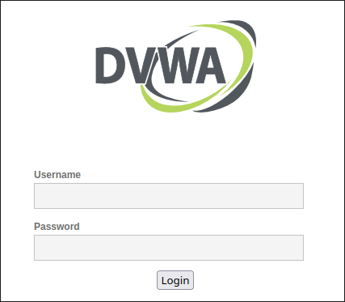

---
## Front matter
title: "Индивидуальный проект. Этап 2"
subtitle: ""
author: "Матюхин Григорий Васильевич"

## Generic otions
lang: ru-RU
toc-title: "Содержание"

## Bibliography
bibliography: bib/cite.bib
csl: pandoc/csl/gost-r-7-0-5-2008-numeric.csl

## Pdf output format
toc: true # Table of contents
toc-depth: 2
lof: true # List of figures
lot: true # List of tables
fontsize: 12pt
linestretch: 1.5
papersize: a4
documentclass: scrreprt
## I18n polyglossia
polyglossia-lang:
  name: russian
  options:
	- spelling=modern
	- babelshorthands=true
polyglossia-otherlangs:
  name: english
## I18n babel
babel-lang: russian
babel-otherlangs: english
## Fonts
mainfont: IBM Plex Serif
romanfont: IBM Plex Serif
sansfont: IBM Plex Sans
monofont: IBM Plex Mono
mathfont: STIX Two Math
mainfontoptions: Ligatures=Common,Ligatures=TeX,Scale=0.94
romanfontoptions: Ligatures=Common,Ligatures=TeX,Scale=0.94
sansfontoptions: Ligatures=Common,Ligatures=TeX,Scale=MatchLowercase,Scale=0.94
monofontoptions: Scale=MatchLowercase,Scale=0.94,FakeStretch=0.9
mathfontoptions:
## Biblatex
biblatex: true
biblio-style: "gost-numeric"
biblatexoptions:
  - parentracker=true
  - backend=biber
  - hyperref=auto
  - language=auto
  - autolang=other*
  - citestyle=gost-numeric
## Pandoc-crossref LaTeX customization
figureTitle: "Рис."
tableTitle: "Таблица"
listingTitle: "Листинг"
lofTitle: "Список иллюстраций"
lotTitle: "Список таблиц"
lolTitle: "Листинги"
## Misc options
indent: true
header-includes:
  - \usepackage{indentfirst}
  - \usepackage{float} # keep figures where there are in the text
  - \floatplacement{figure}{H} # keep figures where there are in the text
---

# Цель работы

Установите DVWA в гостевую систему к Kali Linux.

# Выполнение лабораторной работы

Damn Vulnerable Web Application ([DVWA](https://github.com/digininja/DVWA)) можно установить несколькими способами. Самым удобным является Docker.

## Установка Docker

Воспользуемся официальной [иснтрукцией по установке](https://docs.docker.com/engine/install/debian/).

```bash
# Add Docker's official GPG key:
sudo apt-get update
sudo apt-get install ca-certificates curl
sudo install -m 0755 -d /etc/apt/keyrings
sudo curl -fsSL https://download.docker.com/linux/debian/gpg -o /etc/apt/keyrings/docker.asc
sudo chmod a+r /etc/apt/keyrings/docker.asc

# Add the repository to Apt sources:
$ echo \
    "deb [arch=$(dpkg --print-architecture) signed-by=/etc/apt/keyrings/docker.asc] \
    https://download.docker.com/linux/debian bookworm stable" | \
    sudo tee /etc/apt/sources.list.d/docker.list > /dev/null
$ sudo apt-get update
$ sudo apt-get install docker-ce docker-ce-cli \
    containerd.io docker-buildx-plugin docker-compose-plugin
```

Запустим `hello-world` конттейнер и убедимся, что Docker был установлен верно.

```bash
$ sudo docker run hello-world
```

Дополнительно можно добавить пользователя в группу, чтобы не было необходимости использовать `sudo`.

```bash
$ sudo usermod -aG docker $USER
```

## Запуск DVWA

Возьмем compose файл из GitHub.

```yaml
services:
  dvwa:
    build: .
    image: ghcr.io/digininja/dvwa:latest
    # Change `always` to `build` to build from local source
    pull_policy: always
    environment:
      - DB_SERVER=db
    depends_on:
      - db
    networks:
      - dvwa
    ports:
      - 127.0.0.1:4280:80
    restart: unless-stopped
  db:
    image: docker.io/library/mariadb:10
    environment:
      - MYSQL_ROOT_PASSWORD=dvwa
      - MYSQL_DATABASE=dvwa
      - MYSQL_USER=dvwa
      - MYSQL_PASSWORD=p@ssw0rd
    volumes:
      - dvwa:/var/lib/mysql
    networks:
      - dvwa
    restart: unless-stopped
volumes:
  dvwa:
networks:
  dvwa:
```

Запустим контейнеры.

```bash
$ docker compose up
```

Теперь можем перейти на `localhost:4280`, чтобы увидеть рабочее приложение.



# Выводы

На данном этапе проекта я установил DVWA в гостевую систему к Kali Linux.
