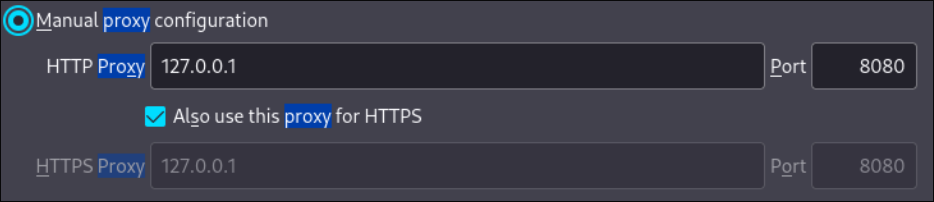
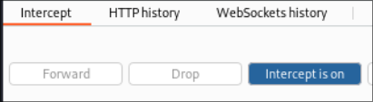
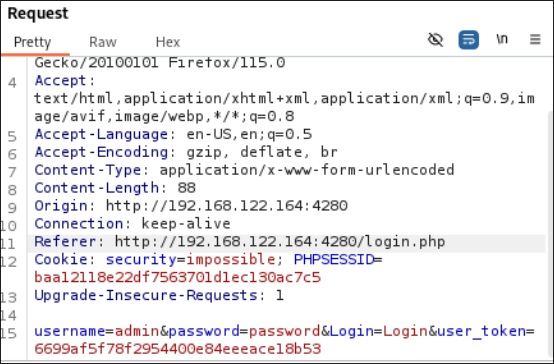

---
## Front matter
lang: ru-RU
title: Индивидуальный проект. Этап 5
subtitle: 
author:
  - Матюхин Г.В.
institute:
  - Российский университет дружбы народов, Москва, Россия
date: 12 октября 2024

## i18n babel
babel-lang: russian
babel-otherlangs: english

## Formatting pdf
toc: false
toc-title: Содержание
slide_level: 3
aspectratio: 169
section-titles: true
theme: metropolis
header-includes:
 - \metroset{progressbar=frametitle,sectionpage=progressbar,numbering=fraction}
---

# Цель работы

Продемонстрировать Burp Suite.

Burp Suite представляет собой набор мощных инструментов безопасности веб-приложений,
которые демонстрируют реальные возможности злоумышленника, проникающего в веб-приложения

# Выполнение лабораторной работы

## Эмуляция MITM

## Настраиваем Intercept

## Видим содержимое запросов

# Выводы

На данном этапе проекта я научился пользоваться Burp Suite.
